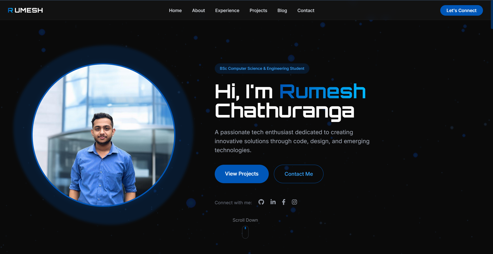

# Rumesh Chathuranga - Portfolio Website

## Overview

This is my personal portfolio website showcasing my education, experience, projects, and skills as a Computer Science & Engineering student.

**⚠️ NOTICE: This website is currently for testing and educational purposes only.**

## Features

- Responsive design for desktop and mobile devices
- Interactive particle background effects
- Timeline-based display of education and experience
- Project showcase with filtering capabilities
- Contact form integration
- Blog section for sharing technical insights

## Technologies Used

- HTML5, CSS3, JavaScript
- Tailwind CSS for styling
- Three.js and P5.js for interactive backgrounds
- GSAP for smooth scrolling animations
- Font Awesome for icons
- FormSpree for contact form handling

## Future Implementations

This portfolio website is a work in progress. Planned future implementations include:

- Dark/light mode toggle
- More interactive project demonstrations
- Integration with GitHub API to automatically display repositories
- Performance optimizations for faster loading
- Multilingual support
- Expanded blog functionality

## Project Status

This project is being actively developed as I learn and improve my web development skills.

## Contact

Feel free to reach out to me via the contact form on the website or through my social media profiles linked on the site.

## License

This project is for personal use and educational purposes. The code structure and design may not be reproduced without permission.